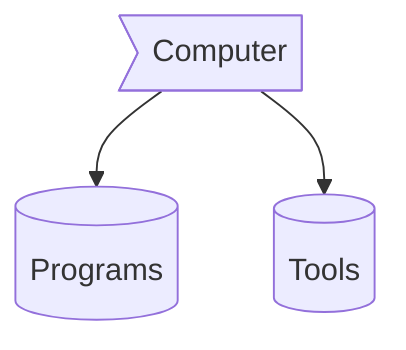

# <div align="center"></img> !Bravo, </img>

<div align="center">
 </img>
<br>

<br />

</div>

  

<div align="center">

 <b> Languages and Tools:
 
Here's the translation to English:

  🧑‍💻 About Me

I am a web developer focused on creating modern, efficient, and scalable digital solutions.  
I have experience working with technologies such as:

- **HTML5**, **CSS3**, and **TypeScript** for developing solid and dynamic web interfaces.
- **React**, **Next.js**, **TailwindCSS**, and **Redux** for building high-performance web applications.
- **Git** and **GitHub** for version control and managing collaborative projects.
- **Visual Studio Code** as my primary integrated development environment (IDE).
- **DBeaver** for efficient database management.

I am characterized by my commitment to code quality, continuous improvement, and the adoption of best practices in software development.  
Currently, I am focused on strengthening my skills in the **frontend** ecosystem and progressively advancing in the **fullstack** area.

**Building solutions that make a difference.**

  
<h3 align="center">🛠️ Technologies I use </h3>

# 💻Tech Stack  
          


### ✍️Random Dev Quote


---


---

</div>
<p align="center">
  
</p>


 
  <br>
</p>

### Computer :> Programs && Tools





- 🌱 I’m currently learning more about **Reactjs(Nextjs)**.
- 👯 I’m looking to collaborate on [github]("https://github.com/metazack89").
- 🤔 I’m looking for help with Nextjs documentation.
- 💬 Ask me about web Development or any tech-related stuff.
- 😄 Pronouns: He/His
- ⚡ Fun fact: I spend almost time to watch **anime**.

## Technologies 

```mermaid
flowchart 
f1[HTML]
f2[Css]
f3[javaScpit]
f4[Markdown]
fw1((ReactJs))
fw2((NextJs))
fw3((Bootstrap))
fw4((tailwind))
fw5((mermaid))
b1((Dbeaver))
b2((Postgretsql))
 subgraph  BackEnd
b1
b2
 end  
 subgraph Framworks 
fw1
fw2
fw3
fw4
fw5
 end
  subgraph  FrontEnd 
 f1
 f2
 f3
 f4
 end  
 f1 --o f2
 f1 --o f3
 f1 --o f4
 f2 --> fw3
 f2 --> fw4
 f3 --o fw1
 f3 --o fw2
 fw2 --o b1
 f4 --> fw5
 b1 --o b2
 ```

## Touch Me  ˊ•⌔•ˋ 

|[Github](https://github.com/metazack89)|[LinkIn](www.linkedin.com/in/cristianortiz89)

